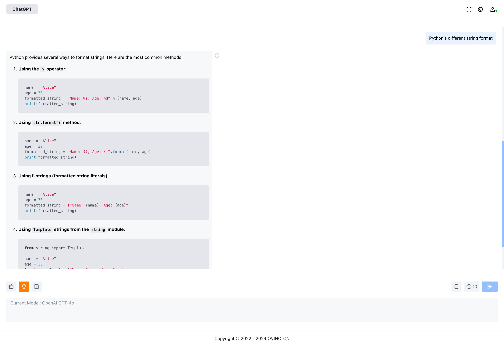

# ChatGPT Web

ChatGPT Web is a powerful multi-model access platform that supports various mainstream AI models and provides WeChat payment integration. The project adopts a front-end and back-end separation architecture, with the front-end built using Vue for static deployment and the back-end using Django for horizontal scaling.

## Features

- **Multi-Model Access**: Supports various AI models such as Azure OpenAI, Tencent Hunyuan, Alibaba Tongyi Qianwen, Baidu ERNIE-BOT, Google Gemini, Moonshot V1, and more.
- **WeChat Payment Integration**: Provides WeChat payment integration, making it convenient for users to perform payment operations.
- **Front-End and Back-End Separation**: The front-end is built using Vue for static deployment, and the back-end is built using Django for horizontal scaling, supporting high concurrent access.

## Tech Stack

- **Front-End**: Vue
- **Back-End**: Django ([View Back-End Code](https://github.com/OVINC-CN/ChatGPTAPI))

## Deployment

### Prepare Environment Variables

```
OVINC_URL=<Please contact us to obtain>
OVINC_WEB_URL=<Please contact us to obtain>
SITE_URL=https://example.com
BACKEND_URL=https://api.example.com
WEB_SOCKET_URL=wss://api.example.com
```

### Build

```bash
yarn && yarn build
```

### Host Static Files

Host the built files on a server for user access.

## License

This project is distributed under the MIT License. For more details, please refer to [LICENSE](./LICENSE).