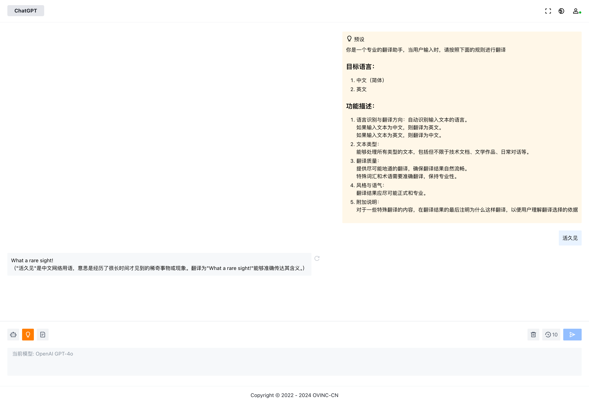

# ChatGPT Web

ChatGPT Web 是一个强大的多模型接入平台，支持多种主流的AI模型，并提供了微信支付接入能力。该项目采用前后端分离的架构，前端由Vue构建，可静态部署，后端使用Django搭建，可横向扩容。

## 功能特点

- **多模型接入**：支持Azure OpenAI、腾讯混元、阿里通义千问、百度ERNIE-BOT、Google Gemini、Moonshot V1等多种AI模型。
- **微信支付接入**：提供了微信支付的接入能力，方便用户进行支付操作。
- **前后端分离**：前端由Vue构建，可静态部署，后端使用Django搭建，可横向扩容，支持高并发访问。

## 技术栈

- **前端**：Vue
- **后端**：Django ([查看后端代码](https://github.com/OVINC-CN/ChatGPTAPI))

## 部署

### 准备环境变量

```
OVINC_URL=<请联系我们获取>
OVINC_WEB_URL=<请联系我们获取>
SITE_URL=https://example.com
BACKEND_URL=https://api.example.com
WEB_SOCKET_URL=wss://api.example.com
```

### 构建

```bash
yarn && yarn build
```

### 托管静态文件

将构建后的文件托管到服务器以供用户访问

## 许可证

本项目基于MIT许可证进行分发，详细信息请参见[LICENSE](./LICENSE)。
